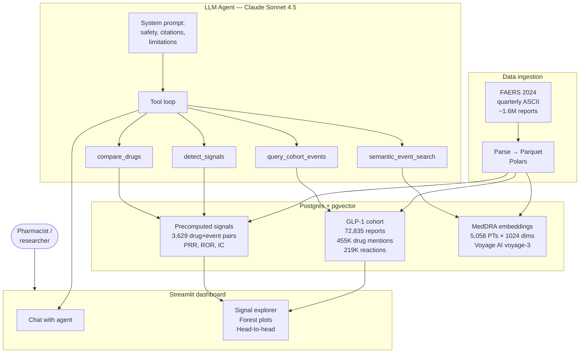

# Pharmacovigilance RAG Assistant

An LLM-powered pharmacovigilance system for GLP-1 receptor agonists,
combining classical disproportionality analysis (PRR, ROR, IC) with
retrieval-augmented generation over the FDA Adverse Event Reporting
System (FAERS) 2024 data.

> **Live demo**: [pharmacovigilance-rag-tb2m67berfdccrlmtxpmep.streamlit.app](https://pharmacovigilance-rag-tb2m67berfdccrlmtxpmep.streamlit.app/)
> First load may take ~30 seconds if the app has been idle.

---

## Motivation

GLP-1 receptor agonists (semaglutide, tirzepatide, liraglutide and others)
had explosive growth in 2024 following FDA approvals for obesity. This
expansion revealed new adverse-event patterns — including **non-arteritic
anterior ischemic optic neuropathy (NAION)** ([JAMA Ophthalmology, 2024](https://jamanetwork.com/journals/jamaophthalmology/fullarticle/2820255)),
**gastroparesis** ([JAMA, 2023](https://jamanetwork.com/journals/jama/fullarticle/2810542)),
and **medication-error signals** driven by new-to-injectable users.

Manually screening FAERS for these signals is slow and requires strong
biostatistics. This project automates the workflow while preserving
methodological rigor: statistical detection with EMA/BCPNN criteria,
semantic search over MedDRA terminology, and an LLM agent that answers
clinical questions with cited evidence and explicit uncertainty.

## Live results

The system detects **11 of 11 GLP-1 safety signals published in
JAMA, NEJM, JAMA Ophthalmology and FDA/EMA communications (2021–2024)**
using standard EMA and BCPNN criteria on FAERS 2024 data.

| Signal | Reference | Detected |
|--------|-----------|:--------:|
| Semaglutide × NAION | JAMA Ophthalmol 2024 | ✓ |
| Semaglutide × Gastroparesis | JAMA 2023 | ✓ |
| Liraglutide × Gastroparesis | JAMA 2023 | ✓ |
| Tirzepatide × Impaired gastric emptying | FDA label 2023 | ✓ |
| Semaglutide × Pancreatitis | FDA label | ✓ |
| Liraglutide × Pancreatitis | FDA label | ✓ |
| Semaglutide × Cholelithiasis | JAMA Intern Med 2022 | ✓ |
| Liraglutide × Cholelithiasis | JAMA Intern Med 2022 | ✓ |
| Semaglutide × Suicidal ideation | EMA signal review 2023 | ✓ |
| Tirzepatide × Injection site pain | NEJM SURPASS-2 2021 | ✓ |
| Semaglutide × Ileus | FDA label update Sep 2023 | ✓ |

Detailed report: [`evaluation/results/known_signals_report.md`](evaluation/results/known_signals_report.md)

## Architecture



## Stack

| Layer | Technology |
|-------|------------|
| Data processing | Polars, Pandas |
| Database | PostgreSQL 17 + pgvector (Supabase, prod / Docker, dev) |
| Statistics | SciPy — custom PRR, ROR with 95% CI, Information Component (BCPNN) |
| Embeddings | Voyage AI `voyage-3` (1024 dimensions) |
| Semantic search | pgvector HNSW cosine index |
| LLM agent | Anthropic Claude Sonnet 4.5 with structured tool use |
| Tool schemas | Pydantic v2 |
| UI | Streamlit + Plotly |
| Orchestration | Prefect-ready (currently CLI-driven) |
| Deployment | Streamlit Community Cloud |

## Data pipeline

1. **Ingestion**. Download the four 2024 FAERS quarters from
   `fis.fda.gov` and extract the seven ASCII files per quarter
   (DEMO, DRUG, REAC, OUTC, RPSR, THER, INDI).
2. **Parsing**. Convert to Parquet with Polars, normalize column names,
   tag each row with its source quarter.
3. **Cohort building**. Identify reports mentioning any GLP-1 active
   ingredient by matching against a normalized brand-and-INN dictionary.
   Deduplicate by `caseid` keeping the latest `caseversion`.
4. **Load**. Bulk `COPY` into PostgreSQL, ~275 MB after indexes.
5. **Background aggregates**. Compute drug×event contingency tables over
   the full FAERS universe (~1.6M reports) for disproportionality math.
6. **Precompute signals**. For every GLP-1 × event pair with ≥3 reports,
   compute PRR, ROR + 95% CI (Haldane-Anscombe corrected), Yates
   chi-square, and BCPNN Information Component. Store in `glp1_signals`
   (1.2 MB). This shrinks the production database from 738 MB to 270 MB.
7. **Embeddings**. Embed every unique MedDRA Preferred Term with
   Voyage AI `voyage-3`. Index with HNSW cosine similarity.

## Signal detection — statistical criteria

For every drug–event pair the system builds a 2×2 contingency table:

|                    | Event X | Other events |
|--------------------|---------|--------------|
| Target drug        | a       | b            |
| All other drugs    | c       | d            |

and computes:

- **PRR** (Proportional Reporting Ratio): `(a/(a+b)) / (c/(c+d))`,
  with Yates-corrected χ². **EMA signal**: PRR ≥ 2, χ² ≥ 4, a ≥ 3.
- **ROR** (Reporting Odds Ratio): `(a·d)/(b·c)` with 95% log-normal CI
  and Haldane-Anscombe continuity correction.
- **IC** (Information Component, BCPNN):
  `log₂((a + 0.5) / (E(a) + 0.5))` with 95% credible interval.
  **BCPNN signal**: lower CI > 0.

Unit-tested against textbook examples (van Puijenbroek et al., 2002).
Reproduces published NAION signal (Hathaway et al., 2024) with
ROR = 67.3 (95% CI: 51.5–88.1), IC = 5.03.

## LLM agent design

Claude Sonnet 4.5 receives a system prompt with four hard constraints:

- Never claim causation.
- Always cite `n=X` alongside every clinical statement.
- Always disclose spontaneous-reporting limitations
  (underreporting, notoriety bias, absence of a denominator).
- Distinguish statistical signals from clinical relevance.

The agent has four tools defined as Pydantic models:

| Tool | Purpose |
|------|---------|
| `semantic_event_search` | Translate lay-term events to MedDRA PTs |
| `detect_signals` | Return top signals for a drug ranked by IC |
| `query_cohort_events` | Filter cohort by demographics and outcome |
| `compare_drugs` | Head-to-head PRR/ROR/IC comparison |

Tool use loop caps at 8 turns and streams all intermediate results back
into the model context. Every claim in the final answer is grounded in
a tool output.

## Evaluation

The system is evaluated on **three complementary axes**:

### 1. End-to-end agent evaluation (15 questions)

| Metric | Value |
|--------|-------|
| Tool-routing accuracy | **100%** |
| PT coverage (bilingual matching) | 93.3% |
| No forbidden claims | **100%** |
| Cites `n=` evidence | **100%** |
| Mentions limitations | **100%** |

Full report: [`evaluation/results/report.md`](evaluation/results/report.md)

### 2. Statistical validation

Unit tests reproduce disproportionality metrics against textbook
examples. See [`tests/test_disproportionality.py`](tests/test_disproportionality.py).

### 3. External clinical validation

**11 of 11 (100%)** published GLP-1 safety signals from JAMA, NEJM,
JAMA Ophthalmology and FDA/EMA communications (2021–2024) are detected
by the system under both EMA and BCPNN criteria.
See [`evaluation/results/known_signals_report.md`](evaluation/results/known_signals_report.md)

## Notable findings from FAERS 2024

Explored via the dashboard and validated against literature:

- **NAION with semaglutide** (n=90, ROR=67.3): reproduces the Hathaway
  et al. (2024) signal from JAMA Ophthalmology.
- **Impaired gastric emptying** dominates the semaglutide signal profile
  (n=818, IC=5.32), consistent with the mechanistically expected effect.
- **Medication errors surge with tirzepatide** ("Incorrect dose
  administered" n=9,802, "Injection site pain" n=5,293): a 2024
  fingerprint of mass-market adoption in patients new to autoinjectors.
- **Pancreatitis differential**: semaglutide and liraglutide show
  ROR≈10, while tirzepatide sits at ROR≈4 — worth exploring whether
  the tirzepatide profile reflects a real class-effect attenuation or
  reporting-bias artifacts.
- **Counterfeit product reports** for semaglutide (n=76) reflect the
  2024 black-market response to shortages.

## Reproducing the project

Requirements: Docker Desktop, Python 3.11, ~1.5 GB free disk.

```bash
# 1. Clone and enter the repo
git clone https://github.com/MaricelPS/pharmacovigilance-rag.git
cd pharmacovigilance-rag

# 2. Set up the environment
python -m venv .venv
.venv\Scripts\activate            # Windows
# source .venv/bin/activate       # Linux/Mac
pip install -e ".[dev]"

# 3. Copy .env.example to .env and add your API keys
copy .env.example .env
# Fill in ANTHROPIC_API_KEY and VOYAGE_API_KEY

# 4. Start local Postgres
docker compose up -d

# 5. Ingest FAERS 2024
python -m src.ingest.download_faers
python -m src.ingest.parse_faers

# 6. Load into Postgres and precompute
python -m src.etl.load_to_postgres
python -m src.etl.build_aggregates
python -m src.etl.precompute_glp1_signals

# 7. Build MedDRA embeddings
python -m src.rag.build_pt_embeddings

# 8. Run the dashboard
streamlit run src/app/streamlit_app.py
```

Full deployment to production (Supabase + Streamlit Cloud) is documented
in the `src/etl/migrate_to_supabase.py` and `Dockerfile`.

## Repository layout

```
├── src/
│   ├── ingest/         # FAERS download and Parquet conversion
│   ├── etl/            # Postgres loading, aggregates, precomputation
│   ├── analytics/      # PRR, ROR, IC — signal detection math
│   ├── rag/            # Embeddings, semantic search, LLM agent, tools
│   └── app/            # Streamlit UI
├── evaluation/
│   ├── eval_dataset.yaml         # 15 end-to-end questions
│   ├── known_signals.yaml        # 11 literature-backed signals
│   ├── run_eval.py               # Agent evaluation
│   ├── validate_known_signals.py # External clinical validation
│   └── results/                  # Metrics and reports
├── tests/              # Unit tests (disproportionality math)
├── notebooks/          # Exploratory analysis
├── Dockerfile          # Production image
├── docker-compose.yml  # Local Postgres + pgvector
└── requirements.txt    # Streamlit Cloud runtime
```

## Limitations

- **Association, not causation**. Spontaneous reports show that events
  co-occur with a drug, not that the drug caused them.
- **No denominator**. FAERS lacks prescription volume data;
  reporting rates cannot be converted to incidence.
- **Notoriety bias**. Media coverage inflates reporting for trending
  drugs (e.g., semaglutide in 2024).
- **Confounding by indication**. GLP-1 patients have baseline elevated
  risk for pancreatitis, cardiovascular events and gallbladder disease.
- **Scope**. This project covers GLP-1 agonists only. Non-GLP-1 drugs
  are used as background for disproportionality math but not queryable.
- **Data cutoff**. FAERS 2024 Q1–Q4 only. Newer quarters would require
  re-running the ingestion pipeline.

## Author

**María Celia Pérez Schmit** — Biochemist and pharmacist transitioning
to data engineering and generative AI. This project is part of a
portfolio combining domain expertise in pharmaceutical sciences with
modern data-and-AI tooling.

## License

MIT — see [`LICENSE`](LICENSE).

## Disclaimer

This tool is for **research and educational purposes only**. It does
not constitute medical advice and does not replace clinical judgment
or official regulatory guidance. Adverse-event reports in FAERS
represent unverified claims and should be interpreted in the context
of the biases and limitations described above.